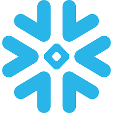
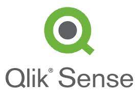
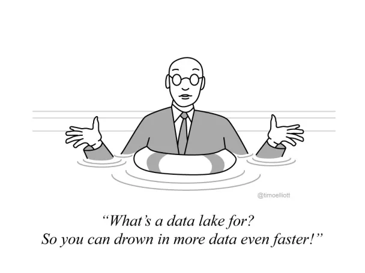

<h1 align="center">
    <!--  -->
    
</h1>

<h4 align="center" >“Data are just summaries of thousands of stories—tell a few of those stories to help make the data meaningful.”~ Dan Heath.</h4>

 
 

 

📊 Crafting stories from data chaos. As a seasoned Data Enthusiast, I bring raw numbers to life, turning them into captivating narratives. Embracing Dan Heath's wisdom, I believe that data are not just summaries but a collection of stories waiting to be told. 💻✨
 

 

 
  
  
  
  

 

 

🌱 Proficient in **SQL, Python, Alteryx, Snowflake, Alation, JIRA, Microsoft Office, Tableau, Qlik Sense, and Power BI.** I have a strong foundation in enterprise analytics, marketing analytics, and business process analytics.

❤️ I aim to actively contribute to open-source ML projects, foster knowledge sharing through community engagement, and experiment with cutting-edge machine learning techniques to drive innovation and collaborative growth.

💬 Certified in **Tableau Desktop and Snowflake (SnowPro Core)**, with a proven track record of automating tasks and optimizing data processes.

⚡ Fun fact: I blend creativity with wellness in my life – from crafting Mandala and Acrylic art to maintaining an active running routine and mastering vegetarian cooking.

🔍🗺️ From a generative AI and data science foundation, I'm working towards understanding ML model interpretability and ethical AI implications.

 

  <h2>⚙️ Technologies & Tools ⚙️</h2>
   
  
  
  
  
  
  
  
  
  
  
  
  
  
  
  
  
  
  
   

 
  

  <h2 style="background-color: #f2f2f2; display: inline-flex; align-items: center; gap: 8px;">
    
  </h2>

 

    <h2 style="background-color: #f2f2f2;">🚀 Project Portfolio 🚀 </h2>

    <h2 style="background-color: #f2f2f2;">💻 Social Media Profiles 💻</h2>

  <h2>🎖️ My Contributions 📝 </h2>
    
  
  
     

<h2 align="center">⚡ Stats ⚡</h2>
 

  
  
   
  

  

